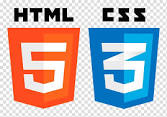

  <!DOCTYPE html>
<html>
  <head>
   

  </head>
  <body >
  
    <h1 >Paul dice:</h1>
       

      <h2 align="center" >BIENVENIDO</h2>
        
Aprende y Haz proyectos
  
                 
   
     
 Recursos de proyectos personales

       
       
      
      
      
    
          
    
  </body>
 
  </html>

 

